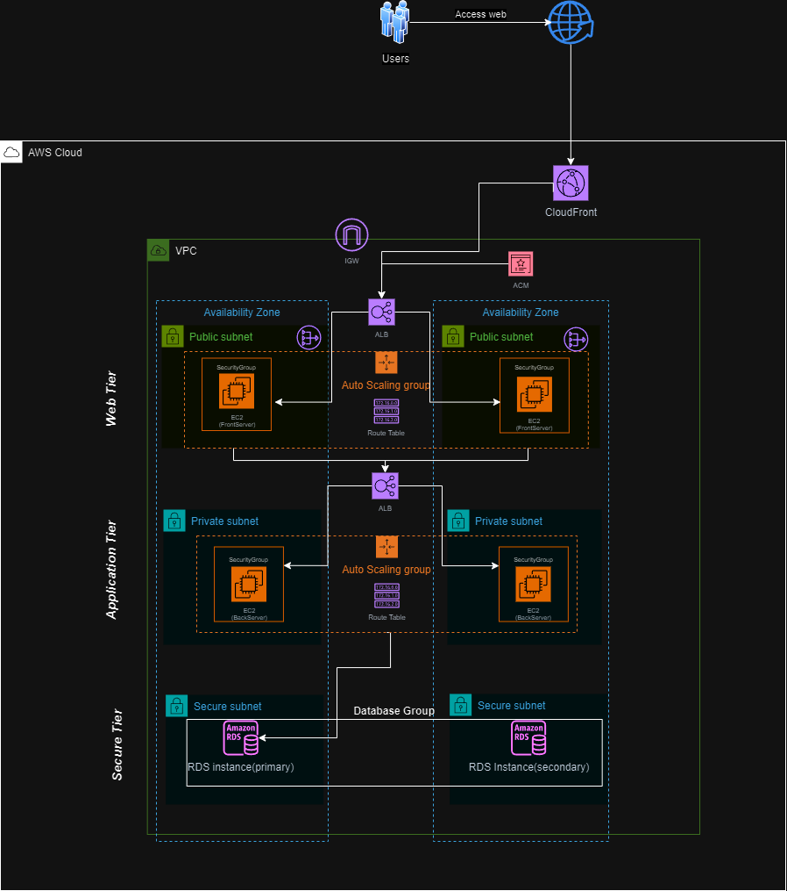

# Three-Tier-Architecture-AWS

This project demonstrates a **Three-Tier Architecture** built on AWS, using Terraform for Infrastructure as Code (IaC). The architecture is designed to provide high availability, scalability, and security across three distinct tiers:

- **Web Tier**: Responsible for hosting auto-scaling EC2 instances with content and distributing it using CloudFront with SSL termination. Additionally, ALB distributes incoming traffic to the web servers and NAT instance is used to provide internet connectivity to the instances in the private subnet.
- **Application Tier**: Auto-scaling EC2 instances in the private subnet handle the back-end logic.
- **Database Tier**: A secure database group with primary and secondary RDS instances, located in a secure subnet to ensure security.

## Architecture Diagram

